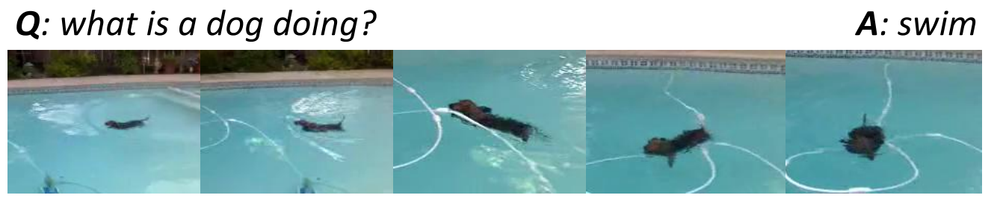

# video-dialog-framework

A basic video dialog and video question answer framework. This repository proposed a simple encoder-decoder vqa and video-dialog framework. You can easily change your custom encoder or decoder by adding a new encoder-class or decoder-class. And this repository contains several simple encoders and decoders(multi-choice decoder and open-domain decoder). 

## Requirements

-  python2.7
-  redis

## Usage

1. Download dataset.

	Baidu Pan: [link](https://pan.baidu.com/s/1geWQCNp) passwd: 7c9b
	
   (or, Google driver: [link](https://drive.google.com/file/d/1BPi4doISkcsuLy4_mgMsfHJOMZH5EHQJ/view?usp=sharing) )
        
2. Install 
        
   * [install redis](https://redis.io/)
   * pip install -r requirements.txt

3. start redis-server (train database server)
	
	redis-server redis.conf

4. Train

	* write a configure file (reference to conf/)
   	* python tools/train.py -c [config-file-path]
        (for example, python tools/train.py -c conf/lf.yaml)

5. Evaluate
        
   python tools/eval.py -c [config-file-path]

## Remark

1. I only release a simple version of video-dialog-framework. Maybe the data preprocessing is a little bit slow. For accelerating the training process, you can convert the data to tf-record, and change the data-load code to read tf-record.
2. The GDecoder class is a very naive decoder, maybe you can add attention mechanism to decode more accurate answer.
